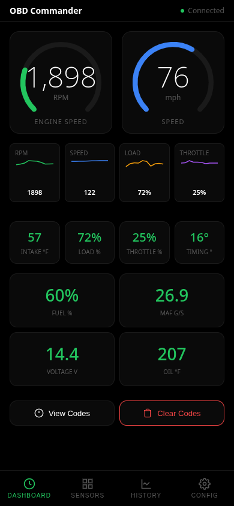
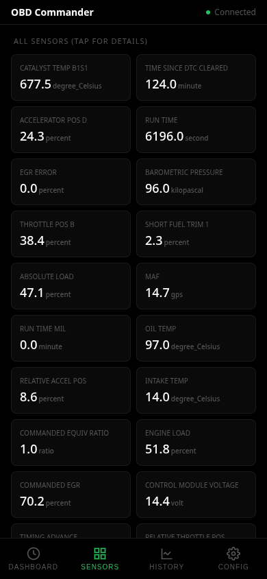
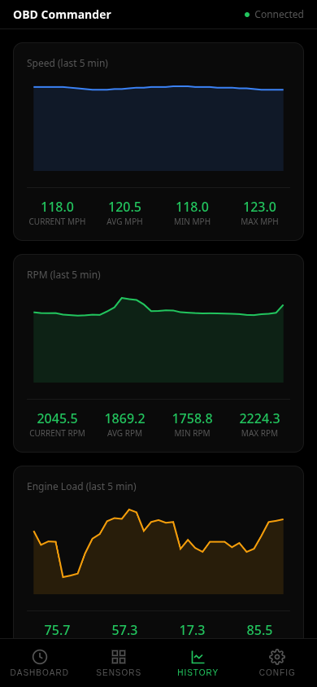
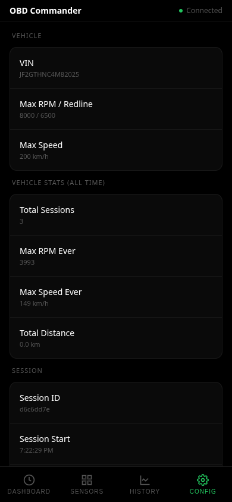
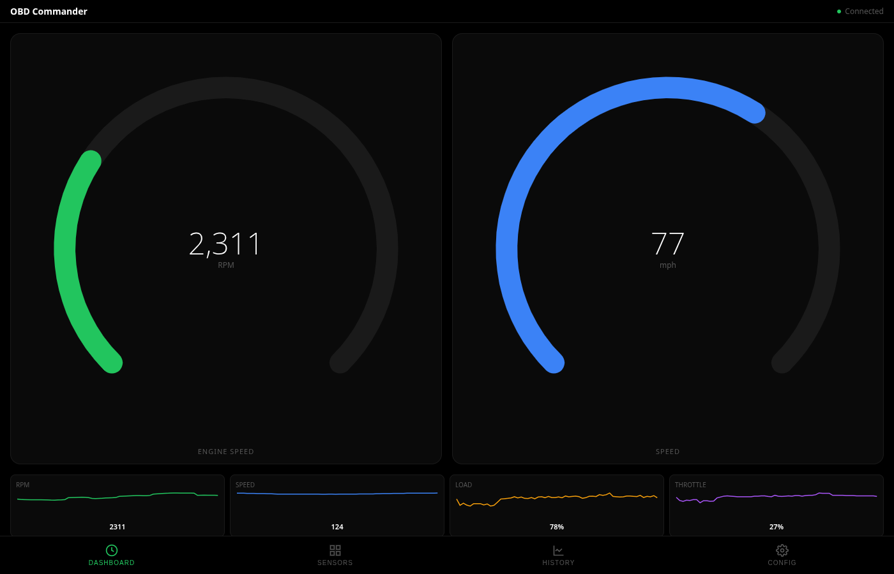

   ____  _____ ____   ____
  / __ \|___  |  _ \ / __ \
 | |  | |  / /| |_) | |  | |
 | |  | | / / |  _ <| |  | |
 | |__| |/ /__| |_) | |__| |
  \____/_____/|____/ \___\_\

       [====>   0 0
     __|_____|__|__
    /              \
   /  OBD COMMANDER \
  /__________________\
       |   ||   |

---



**Professional car computer system** with CLI, WebSocket server, and mobile-first web dashboard. Works with any OBD-II vehicle (1996+).

**Fully offline** — no cloud, no external APIs, no network required.

[](https://github.com/kleinpanic/obd-dashboard/actions/workflows/build.yml)
[](https://opensource.org/licenses/MIT)

## Features

- **Real-time monitoring** — Live gauges for RPM, speed, engine load
- **WebSocket server** — 4Hz push updates to browser
- **SQLite logging** — Full session history, offline-capable
- **Mobile-first UI** — Dark/light themes, metric/imperial units
- **DTC diagnostics** — View and clear trouble codes
- **Multi-vehicle support** — Auto VIN decode, per-vehicle profiles
- **CLI interface** — Headless mode, data export, system control
- **MCP server** — AI assistant integration

## Screenshots

### Mobile
| Dashboard | Sensors | History | Config |
|-----------|---------|---------|--------|
|  |  |  |  |

### Desktop


## Quick Start

```bash
# Clone
git clone https://github.com/kleinpanic/obd-dashboard.git
cd obd-dashboard

# Install system dependencies (Linux)
make install-deps

# Setup Python environment
make venv
source venv/bin/activate

# Run
./obdc server start

# Open http://localhost:9000
```

## Requirements

### System Dependencies

| Dependency | Purpose | Install |
|------------|---------|---------|
| Python 3.9+ | Runtime | `apt install python3 python3-pip python3-venv` |
| libusb-1.0 | USB serial | `apt install libusb-1.0-0` |
| dialout group | USB access | `sudo usermod -aG dialout $USER` |

### Python Dependencies

| Package | Purpose |
|---------|---------|
| `obd` | ELM327 OBD-II communication |
| `fastapi` | REST + WebSocket server |
| `uvicorn[standard]` | ASGI server |
| `websockets` | WebSocket protocol |

Full list in `requirements.txt`.

## Supported Architectures

| Architecture | Platform | Status |
|-------------|----------|--------|
| x86_64 | Linux desktop/server | ✅ Primary |
| aarch64 | Raspberry Pi 4/5 (64-bit) | ✅ Tested |
| armv7l | Raspberry Pi 3/Zero 2 (32-bit) | ✅ Supported |

**Raspberry Pi 4/5 is the recommended platform for in-car use.**

See [docs/ARCHITECTURE.md](docs/ARCHITECTURE.md) for details.

## CLI Commands

### Server Management
```bash
./obdc server start [port]     # Start web server (default: 9000)
./obdc server stop             # Stop server
./obdc server status           # Check status
./obdc server restart [port]   # Restart
./obdc server headless         # Start without UI (daemon mode)
```

### OBD Queries
```bash
./obdc status                  # Connection and vehicle info
./obdc scan                    # List all sensors with values
./obdc get RPM                 # Get single sensor
./obdc get SPEED               # Current speed
./obdc live                    # Stream live data (JSON lines)
./obdc vin                     # Get VIN
./obdc dtc                     # Diagnostic trouble codes
./obdc capabilities            # What can be read/controlled
```

### Database
```bash
./obdc db stats                # Database statistics
./obdc db export               # Export all data as JSON
./obdc db export --csv         # Export as CSV
./obdc db query "SELECT * FROM sensor_data LIMIT 10"
./obdc db clear                # Clear all data
./obdc db sessions             # List all driving sessions
```

### Logs
```bash
./obdc log tail 50             # Last 50 log lines
./obdc log follow              # Follow live logs
```

## API Endpoints

| Endpoint | Method | Description |
|----------|--------|-------------|
| `/` | GET | Web dashboard |
| `/api/status` | GET | Connection status |
| `/api/sensors` | GET | All sensor readings (cached) |
| `/api/history/{sensor}` | GET | Historical data |
| `/api/dtc` | GET | Diagnostic trouble codes |
| `/api/dtc/clear` | POST | Clear all DTCs |
| `/api/sessions` | GET | List driving sessions |
| `/api/vehicle` | GET | Current vehicle profile |
| `/api/profiles` | GET | All stored vehicle profiles |
| `/api/config` | GET/POST | UI configuration |
| `/api/logs` | GET | Structured logs |
| `/ws` | WebSocket | Real-time updates at 4Hz |

## Offline Operation

**OBD Commander works without any network connection.**

- SQLite database for all logging
- Embedded VIN decode table (no NHTSA API)
- No external JavaScript libraries
- No CDN dependencies
- WebSocket runs on localhost

## Installation Options

### User-Local (No sudo)
```bash
make install-user
obdc server start
```

### System-Wide
```bash
sudo make install
obdc server start
```

### systemd Service (Auto-start)
```bash
sudo make install-service
sudo systemctl enable --now obdc
```

## MCP Server

Model Context Protocol server for AI assistant integration:

```bash
./obdc mcp start
```

Tools: `obdc_get_status`, `obdc_get_sensors`, `obdc_get_sensor_history`, `obdc_get_dtc`, `obdc_stream_live`

## Security Audit

```bash
make audit
```

Checks for:
- Hardcoded secrets
- .env in git
- Missing .gitignore entries
- External HTTP calls

## Documentation

- [INSTALL.md](docs/INSTALL.md) — Full installation guide
- [ARCHITECTURE.md](docs/ARCHITECTURE.md) — Platform support, offline, performance

## Tested Vehicles

- 2021 Subaru Crosstrek (FB20 2.0L)
- Any OBD-II compliant vehicle (1996+)

## License

MIT License — see [LICENSE](LICENSE) file.

Free and Open Source Software (FOSS).

---

**GitHub:** https://github.com/kleinpanic/obd-dashboard
