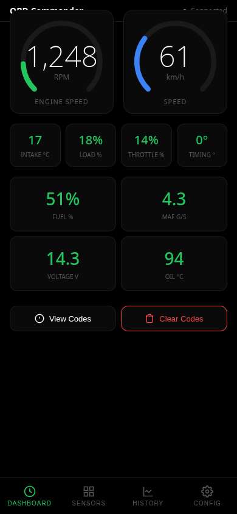
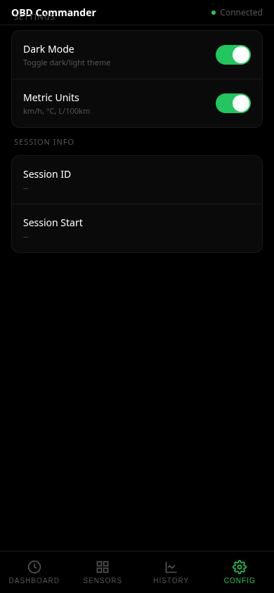
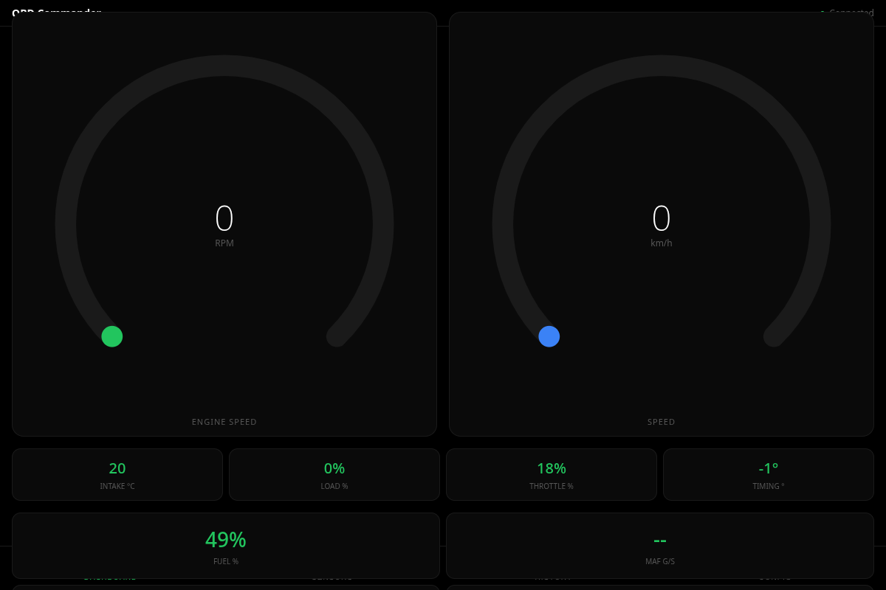

# OBD Commander



Professional car computer system with CLI, WebSocket server, and web dashboard. Works with any OBD-II vehicle (1996+).

## Features

- **Real-time monitoring**: Live gauges for RPM, speed, and key metrics
- **WebSocket server**: Real-time push updates at 4Hz
- **SQLite logging**: Historical data with session tracking
- **Mobile-first UI**: Dark/light themes, metric/imperial units
- **DTC support**: View and clear diagnostic trouble codes
- **CLI interface**: Headless mode, data export, system control
- **MCP server**: Model Context Protocol for AI integration
- **Session tracking**: Each drive is a unique session

## Screenshots

### Mobile
| Dashboard | Sensors | History | Config |
|-----------|---------|---------|--------|
|  |  |  |  |

### Desktop


## Quick Start

```bash
# Clone
git clone https://github.com/kleinpanic/obd-dashboard.git
cd obd-dashboard

# Setup
python3 -m venv venv
source venv/bin/activate
pip install -r requirements.txt

# Run
./obdc server start

# Open http://localhost:9000
```

## CLI Commands

### Server Management
```bash
./obdc server start [port]     # Start web server (default: 9000)
./obdc server stop             # Stop server
./obdc server status           # Check status
./obdc server restart [port]   # Restart
./obdc server headless         # Start without UI (daemon mode)
```

### OBD Queries
```bash
./obdc status                  # Connection and vehicle info
./obdc scan                    # List all sensors with values
./obdc get RPM                 # Get single sensor
./obdc get SPEED               # Current speed
./obdc live                    # Stream live data (JSON lines)
./obdc vin                     # Get VIN
./obdc dtc                     # Diagnostic trouble codes
./obdc capabilities            # What can be read/controlled
```

### Database
```bash
./obdc db stats                # Database statistics
./obdc db export               # Export all data as JSON
./obdc db export --csv         # Export as CSV
./obdc db query "SELECT * FROM sensor_data LIMIT 10"
./obdc db clear                # Clear all data
./obdc db sessions             # List all driving sessions
```

### Logs
```bash
./obdc log tail 50             # Last 50 log lines
./obdc log follow              # Follow live logs
```

## Headless Mode

Run without web UI for data logging only:

```bash
./obdc server headless --interval 1 --log /var/log/obdc.log
```

Outputs JSON lines to stdout for piping:

```bash
./obdc live --interval 0.5 | jq '.sensors.RPM'
```

## API Endpoints

| Endpoint | Method | Description |
|----------|--------|-------------|
| `/` | GET | Web dashboard |
| `/api/status` | GET | Connection status |
| `/api/sensors` | GET | All sensor readings |
| `/api/sensors/{name}` | GET | Single sensor with history |
| `/api/history/{sensor}` | GET | Historical data (5min default) |
| `/api/dtc` | GET | Diagnostic trouble codes |
| `/api/dtc/clear` | POST | Clear all DTCs |
| `/api/sessions` | GET | List driving sessions |
| `/api/config` | GET/POST | UI configuration |
| `/ws` | WebSocket | Real-time updates |

## MCP Server

Model Context Protocol server for AI assistant integration:

```bash
# Start MCP server
./obdc mcp start

# MCP tools available:
# - obdc_get_status
# - obdc_get_sensors
# - obdc_get_sensor_history
# - obdc_get_dtc
# - obdc_stream_live
```

Configure in your MCP client:
```json
{
  "mcpServers": {
    "obdc": {
      "command": "/path/to/obdc",
      "args": ["mcp", "start"]
    }
  }
}
```

## Systemd Service (RPi4)

```bash
# Install
mkdir -p ~/.config/systemd/user
cp obdc.service ~/.config/systemd/user/
systemctl --user daemon-reload
systemctl --user enable --now obdc

# Access at http://localhost:9000
```

## Requirements

- Python 3.8+
- ELM327 OBD adapter (USB recommended)
- Works on Linux, macOS, Windows

## Tested Vehicles

- 2021 Subaru Crosstrek
- Any OBD-II compliant vehicle (1996+)

## Architecture

```
┌─────────────────────────────────────────┐
│        FastAPI + WebSocket Server       │
│         (uvicorn, ~50MB RAM)            │
├─────────────────────────────────────────┤
│  CLI (obdc) - Full system control       │
│  - Server management                    │
│  - Database operations                  │
│  - Headless logging                     │
│  - MCP server                           │
├─────────────────────────────────────────┤
│  SQLite (~/.local/share/obdc/obdc.db)   │
│  - Sessions with unique IDs             │
│  - Time-series sensor data              │
│  - DTC history                          │
└─────────────────────────────────────────┘
```

## License

MIT
